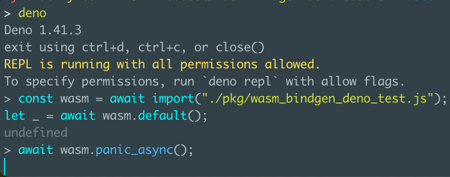

Repro for deno bug

To reproduce:

```
wasm-pack build --target web
```

Then inside Deno:

```js
const wasm = await import("./pkg/wasm_bindgen_deno_test.js");
let _ = await wasm.default();
await wasm.panic_async();
```

The future never resolves


